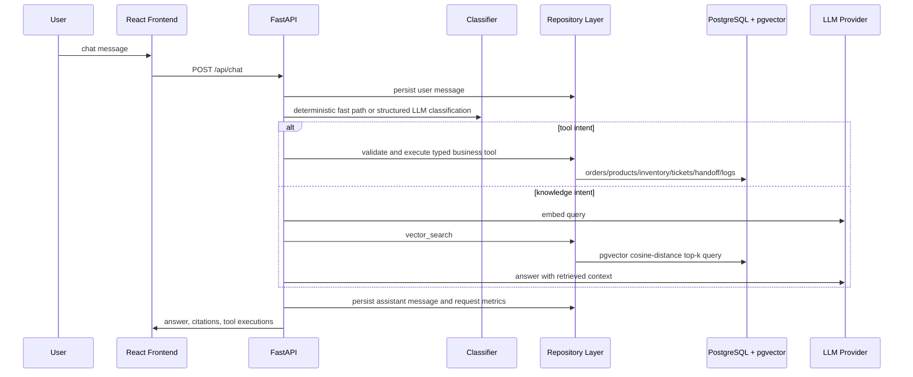

# Architecture

NexusAgent uses explicit workflow routing instead of an unconstrained autonomous agent. Requests are classified, validated, routed, and persisted through repository boundaries.

## Repository Layer

The request path uses Async SQLAlchemy repositories:

- `DocumentRepository`: documents, chunks, delete cascade, pgvector retrieval.
- `ConversationRepository`: conversations and messages.
- `BusinessRepository`: orders, products, inventory, tickets, handoffs, tool logs, request metrics.

FastAPI injects an `AsyncSession` with `get_session`. APIs should not access global mutable demo stores.

## Retrieval

`document_chunks.embedding` is a pgvector `Vector(256)`. PostgreSQL retrieval uses cosine distance and returns rows ordered by nearest chunk. The SQLite fallback exists only for local unit-test isolation.

No-context behavior is threshold-driven by `RAG_SIMILARITY_THRESHOLD`; citations are created only from retrieved chunks.

Migration `0002` explicitly deletes old pre-production document/chunk rows before changing legacy `vector(64)` storage to `vector(256)`. This avoids pretending existing 64-dimensional embeddings can be safely resized in place.

## Parsing

- PDF: PyMuPDF reads per page and preserves `page_number`.
- DOCX: python-docx reads paragraphs.
- TXT/Markdown: UTF-8 text parser.

Parser implementations live behind the `DocumentParser` abstraction in `backend/app/rag/parsers.py`.

## Intent Classification

Routing uses:

1. deterministic fast path for high-confidence business/support intents;
2. LLM structured JSON classifier for lower-confidence messages;
3. Pydantic validation;
4. malformed/low-confidence fallback to `unknown`.

Unvalidated JSON never enters the business routing layer.

## Docker Routing

The production frontend image uses Nginx. `/api/` is proxied to `http://backend:8000/api/`, and SPA routes fall back to `/index.html`.

The backend Docker command runs `alembic upgrade head` before Uvicorn. Docker sets `AUTO_CREATE_SCHEMA=false` so schema management is handled by Alembic rather than runtime `create_all`.
