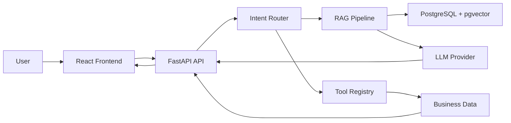

# Architecture

NexusAgent uses explicit workflow routing rather than a fully open-ended agent. A request is classified into an intent, validated entities are extracted, and the router selects either RAG or a typed business tool.

## RAG Flow

Documents are parsed by file type, cleaned, split with paragraph-aware chunking, embedded, and stored in PostgreSQL as chunks with pgvector embeddings and document metadata. Retrieval embeds the user query and, on PostgreSQL, executes a pgvector cosine-distance query ordered by nearest chunks. Citations are derived only from returned database rows. The default mock provider uses deterministic 64-dimensional hash embeddings so demos and tests work without secrets.

## Agent Routing

Supported intents include `knowledge_query`, `order_query`, `product_query`, `inventory_query`, `refund_request`, `technical_support`, `create_ticket`, `human_handoff`, `general_conversation`, and `unknown`.

Routing is explicit:

- `knowledge_query` -> RAG pipeline
- `order_query` -> `get_order_status`
- `inventory_query` -> `check_inventory`
- `product_query` -> `search_products`
- `create_ticket` -> `create_support_ticket`
- `human_handoff` -> `create_handoff_request`

## Data Storage

Runtime data access goes through async SQLAlchemy repositories. The production path targets PostgreSQL with pgvector. Unit tests use SQLite as an isolation strategy, while pgvector integration tests run when `PGVECTOR_TEST_DATABASE_URL` is available.

## Parser Flow

- PDF: PyMuPDF reads text per page and preserves `page_number`.
- DOCX: python-docx reads paragraphs.
- TXT/Markdown: UTF-8 text parsing.
