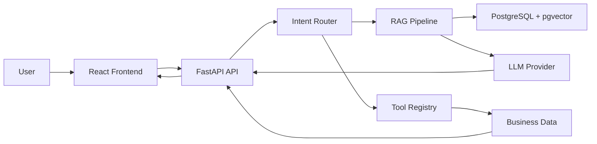

# Architecture

NexusAgent uses explicit workflow routing rather than a fully open-ended agent. A request is classified into an intent, validated entities are extracted, and the router selects either RAG or a typed business tool.

## RAG Flow

Documents are cleaned, split with paragraph-aware chunking, embedded, and stored as chunks with document metadata. Retrieval embeds the user query, ranks chunks by cosine similarity, and returns citations derived only from retrieved chunks. The default mock provider uses deterministic hash embeddings so demos and tests work without secrets.

## Agent Routing

Supported intents include `knowledge_query`, `order_query`, `product_query`, `inventory_query`, `refund_request`, `technical_support`, `create_ticket`, `human_handoff`, `general_conversation`, and `unknown`.

Routing is explicit:

- `knowledge_query` -> RAG pipeline
- `order_query` -> `get_order_status`
- `inventory_query` -> `check_inventory`
- `product_query` -> `search_products`
- `create_ticket` -> `create_support_ticket`
- `human_handoff` -> `create_handoff_request`

## Data Storage

Production schema targets PostgreSQL with pgvector. The demo runtime also includes an in-memory store so the application can run in constrained portfolio environments without a local database.

