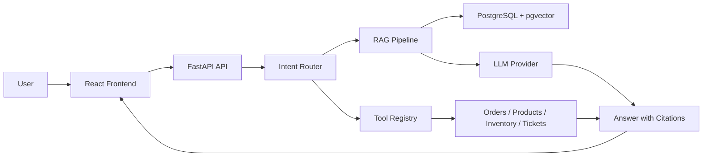

# NexusAgent

Production-oriented AI customer support and knowledge agent platform for the fictional NovaTech electronics support desk.

## Screenshot

Add screenshots after running the frontend locally. The application includes a landing page, chat workspace, knowledge base manager, conversation viewer, ticket list, and analytics dashboard.

## Live Demo

No hosted demo is configured yet. The project is designed to run locally with mock AI by default and can be deployed with Docker.

## Features

- AI support chat with intent badges, tool execution indicators, and citations.
- Knowledge base ingestion with chunking, embeddings, vector-style retrieval, and source snippets.
- Business tool calling for orders, products, inventory, support tickets, and human handoff.
- Conversation memory and admin views for documents, tickets, conversations, and analytics.
- Deterministic mock LLM provider for demos, tests, and CI without secrets.
- OpenAI provider abstraction for production model and embedding calls.
- PostgreSQL + pgvector schema with Alembic migration.
- Docker Compose setup and GitHub Actions CI.

## Architecture



NexusAgent is not a simple chatbot wrapper. It separates intent classification, workflow routing, retrieval, tool execution, and response generation so each layer can be tested and audited.

## How It Works

1. The user sends a chat message.
2. The backend classifies intent into a structured Pydantic model.
3. The router chooses a RAG workflow or a typed business tool.
4. Tool inputs are validated and logged.
5. Knowledge answers include citations generated from retrieved chunks only.
6. Conversations and analytics are stored in the demo runtime.

## RAG Pipeline

Documents are cleaned, split with paragraph-aware chunking, embedded, and searched by cosine similarity. Chunk metadata includes document id, document name, chunk index, page number when available, and content snippet. The default mock provider uses deterministic embeddings so the project works without `OPENAI_API_KEY`.

## Agent Routing

Supported intents include `knowledge_query`, `order_query`, `product_query`, `inventory_query`, `refund_request`, `technical_support`, `create_ticket`, `human_handoff`, `general_conversation`, and `unknown`.

## Tool Calling

Implemented tools:

- `get_order_status`
- `search_products`
- `check_inventory`
- `create_support_ticket`
- `create_handoff_request`

Each tool has a name, description, input schema, output payload, and handler backed by NovaTech demo records.

## Evaluation

The backend includes `backend/evals` with 15 deterministic cases. Metrics include intent accuracy, retrieval/citation checks, no-context refusal rate, tool selection accuracy, and latency. No fake LLM-judge scores are reported.

## Tech Stack

- Backend: Python, FastAPI, Pydantic, SQLAlchemy 2.x, Alembic
- AI: provider abstraction, OpenAI-ready provider, deterministic mock provider
- RAG: PostgreSQL + pgvector schema, embeddings, vector search interface
- Frontend: React, TypeScript, Vite, React Router, TanStack Query, Lucide React
- Quality: pytest, pytest-asyncio, httpx, Ruff, mypy-ready config
- Delivery: Docker, Docker Compose, GitHub Actions

## Project Structure

```text
nexus-agent/
  backend/
    app/
    alembic/
    evals/
    tests/
  frontend/
    src/
  sample_data/
  scripts/
  .github/workflows/
```

## Quick Start

```bash
cd nexus-agent/backend
python -m venv .venv
.venv\Scripts\activate
pip install -r requirements.txt
uvicorn app.main:app --reload
```

In a second terminal:

```bash
cd nexus-agent/frontend
npm install
npm run dev
```

Open `http://localhost:5173`.

## Environment Variables

Copy `.env.example` to `.env` for local customization.

- `LLM_PROVIDER=mock` runs without secrets.
- `LLM_PROVIDER=openai` enables the OpenAI provider when `OPENAI_API_KEY` is set.
- `DATABASE_URL` points to PostgreSQL for production-style storage.
- `CORS_ORIGINS` controls browser access.

Authentication is simplified for portfolio demonstration purposes.

## Docker Setup

```bash
docker compose up --build
```

Compose starts frontend, backend, and PostgreSQL using `pgvector/pgvector:pg16`.

## Local Development

Backend:

```bash
cd backend
pytest
ruff check .
PYTHONPATH=. python evals/run_eval.py
```

Frontend:

```bash
cd frontend
npm run typecheck
npm run build
```

## Demo Questions

```text
What is NovaTech's return policy?
Where is order ORD-10001?
Is the Wireless Headphones product in stock?
My keyboard stopped working. Please create a support ticket.
Do you offer drone insurance?
```

The final question demonstrates no-context refusal instead of hallucinated policy details.

## API Documentation

Start the backend and open:

- OpenAPI: `http://127.0.0.1:8000/docs`
- Health: `GET /api/health`
- Chat: `POST /api/chat`
- Documents: `GET /api/documents`
- Tickets: `GET /api/tickets`
- Analytics: `GET /api/analytics/overview`

## Design Decisions

Key decisions are documented in `DECISIONS.md`: PostgreSQL + pgvector, explicit workflow routing, mock provider by default, and simplified authentication for demo scope.

## Known Limitations

- Runtime demo persistence is in-memory; production repositories should connect the service layer to PostgreSQL.
- PDF and DOCX uploads are accepted by policy, but the current demo extraction path treats uploaded bytes as text.
- Real authentication and role-based authorization are intentionally not fully implemented.
- Docker runtime verification depends on local Docker availability.

## Future Improvements

- SQLAlchemy repositories wired into all services.
- Dedicated PDF/DOCX parsers with page-level metadata.
- Database integration tests against pgvector.
- Production authentication and authorization.
- Hosted deployment with managed Postgres and CI-based migrations.

## License

MIT

