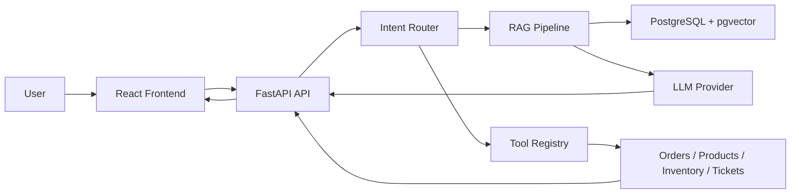

# NexusAgent

Production-oriented AI support and knowledge agent with RAG, pgvector retrieval, tool execution, structured intent routing, evaluation, and full-stack deployment readiness.

NexusAgent is a portfolio project for the fictional NovaTech electronics support desk. It shows the engineering behind an LLM application: database-backed RAG, typed tool execution, source citations, parser boundaries, deterministic tests, Docker packaging, and CI wiring.

## Live Demo

Not deployed yet.

- Frontend: pending
- API Docs: pending
- Health Check: pending
- Demo Video: pending

The planned public portfolio demo runs in deterministic MockProvider mode for predictable behavior and zero API-key exposure. OpenAI can be enabled through platform secrets by setting `LLM_PROVIDER=openai` and `OPENAI_API_KEY`.

## Why This Project Exists

The goal is not to add many chat modes or decorative UI screens. The goal is to demonstrate a realistic AI application runtime where the backend owns durable state, retrieval is auditable, tool calls are validated, and local/CI runs can work without API secrets.

## Portfolio Highlights

- FastAPI backend with Async SQLAlchemy repository layer.
- PostgreSQL + pgvector retrieval path for `document_chunks.embedding`.
- Pydantic-validated intent classification and tool input schemas.
- Deterministic mock LLM provider for CI and demos.
- OpenAI provider that requests configured embedding dimensions instead of slicing vectors.
- PDF parsing with PyMuPDF, DOCX parsing with python-docx, and text parsing for TXT/Markdown.
- React/Vite frontend with chat, documents, conversations, tickets, and analytics.
- Docker Compose with PostgreSQL pgvector, backend, and Nginx-served frontend.
- GitHub Actions backend/frontend CI, including pgvector integration tests.

## Screenshots

No runtime screenshots are committed yet. Screenshot capture guidance is tracked in `docs/screenshots/README.md`.

## Architecture



## Key Engineering Challenges

- Keeping citations tied only to retrieved database chunks.
- Avoiding global mutable demo state in production request paths.
- Supporting local test isolation while keeping PostgreSQL + pgvector as the production target.
- Separating deterministic fast-path intent routing from LLM structured output validation.
- Keeping upload parsing out of `main.py` and preserving PDF page metadata.
- Making tool failures safe, logged, and testable.

## Production Vs Demo Mode

`LLM_PROVIDER=mock` is the default. It uses deterministic embeddings and responses so tests and demos run without secrets. `LLM_PROVIDER=openai` enables the OpenAI provider when `OPENAI_API_KEY` is set. PostgreSQL is the intended runtime database; SQLite is used only for fast local unit-test isolation.

## RAG Pipeline

Documents are parsed by file type, split into paragraph-aware chunks, embedded into 256-dimensional vectors, and stored in `document_chunks.embedding`. PostgreSQL deployments use pgvector cosine distance to return top-k chunks above `RAG_SIMILARITY_THRESHOLD`. Citations are built from the returned database rows.

## Tool Calling

Implemented tools:

- `get_order_status`
- `search_products`
- `check_inventory`
- `create_support_ticket`
- `create_handoff_request`

Each tool has a Pydantic input schema, a typed handler, and a `tool_execution_logs` record for success or failure.

## Quick Start

```bash
cd backend
python -m venv .venv
.venv\Scripts\activate
pip install -r requirements.txt
uvicorn app.main:app --reload
```

In a second terminal:

```bash
cd frontend
npm ci
npm run dev
```

Open `http://localhost:5173`.

## Environment Variables

Copy `.env.example` to `.env`.

- `LLM_PROVIDER=mock` runs without secrets.
- `LLM_PROVIDER=openai` uses OpenAI when `OPENAI_API_KEY` is configured.
- `DATABASE_URL` points to PostgreSQL.
- `EMBEDDING_DIMENSIONS=256` must match the vector column dimension.
- `RAG_SIMILARITY_THRESHOLD=0.18` controls no-context behavior.

## Docker

```bash
docker compose up --build
```

Compose defines PostgreSQL with `pgvector/pgvector:pg16`, the FastAPI backend, and an Nginx frontend image. `frontend/nginx.conf` proxies `/api/` to `http://backend:8000/api/` and uses SPA fallback with `try_files`.

The backend container runs `alembic upgrade head` before starting Uvicorn. In Docker, `AUTO_CREATE_SCHEMA=false` avoids mixing `create_all` with Alembic migrations.

## Evaluation

```bash
cd backend
PYTHONPATH=. python evals/run_eval.py
```

The current deterministic suite has 16 cases covering intent accuracy, tool selection, citation presence, expected cited document, no-context refusal, and latency. The script writes `backend/evals/eval_results.json` and `backend/evals/EVAL_REPORT.md`.

## Local Checks

```bash
cd backend
ruff check .
pytest -m "not integration"
pytest -m integration
PYTHONPATH=. python evals/run_eval.py
```

```bash
cd frontend
npm ci
npm run typecheck
npm run build
```

`pytest -m integration` requires `PGVECTOR_TEST_DATABASE_URL`. Without it, those tests are skipped locally and run in CI.

Smoke tests for a running API:

```bash
python scripts/smoke_test.py
```

Set `NEXUS_API_BASE_URL` to test a deployed backend.

## Deployment

Deployment options are documented in `DEPLOYMENT.md`. The project is not deployed yet.

## Known Limits

- Authentication is intentionally simplified for portfolio scope.
- Local pgvector integration requires a running PostgreSQL/pgvector database.
- Docker runtime verification requires Docker to be installed locally.
- Mock embeddings are deterministic and useful for tests, but OpenAI embeddings should be used for realistic retrieval quality.
- Migration `0002` intentionally deletes pre-production 64-dimensional document/chunk embeddings before switching to `Vector(256)`. Re-upload or reseed documents after upgrading old local databases.

## License

MIT
